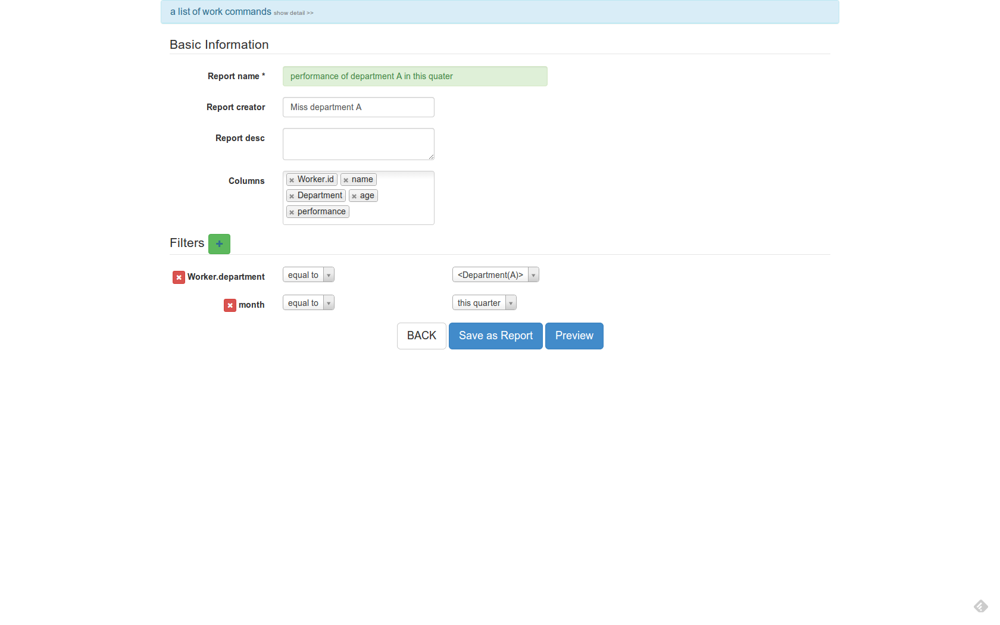
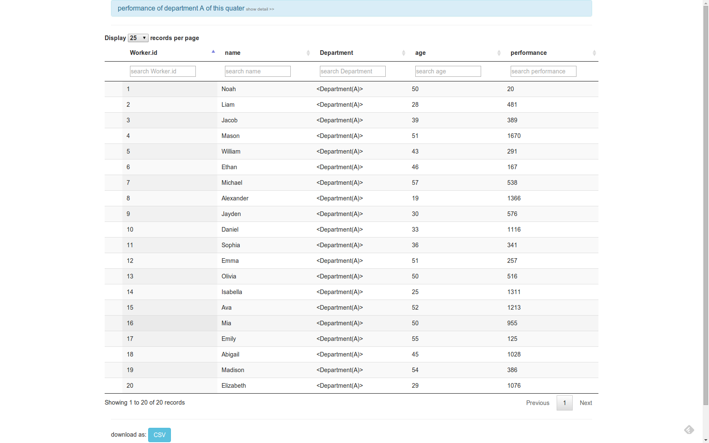
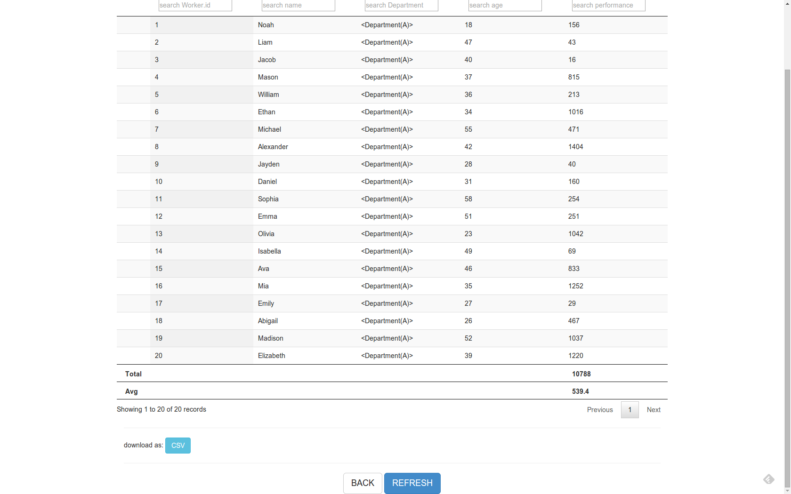

Tutorial
========

Flask-Report may help you to create beautiful reports in web pages quickly,
Here we will guide to complete some reports using it.

We assume there is a toy factory with 3 departmets, A, B and C, and in each 
department, some workers worked there. Each day, the workers receive work
commands which contains number of toys to be made. For simplicity, we assume
only work commands in last 180 days are keeped.

Note, this is unlikely a real scenario, in a real factory, you should first
use ETL system to process the raw data, then generate report

The boss want to see reports of deparments and the department leader want
to see reports of each worker in her department.

Before we start this tutorial, you should install Flask-Report, and enter
the tutorial directory in flask_report source directory.

First, we need to create a Flask app skeleton. 

.. literalinclude:: ../../flask_report/tutorial/basemain.py
   :lines: 3, 7-
   :linenos:

Next, We create some models and add some records.

.. literalinclude:: ../../flask_report/tutorial/models.py
  :lines: 3, 7-
  :linenos:

.. literalinclude:: ../../flask_report/tutorial/utils.py
  :lines: 3, 8-
  :linenos:

Assume the department leaders ask to see the performance of her workers this 
month.  
So we create our first data set, worker and his performance, execute *tools/create_data_set.py*:

.. code-block:: bash
  
  python -m flask_report.tools.create_data_set.py  # don't use flask.ext.report 

this tool will guide you to create a data set, here we assume the configuration
directory is 'report-conf'. After we create the data set, we could find a new 
data set configuration directory. 

and let us open *report-conf/data-sets/1/meta.yaml* to check the content:

.. code-block:: yaml

   {
      name: worker and his performance in a time span
      description: as the name
      create_time: 2014-11-16 12:03:27.423386
      creator: xiechao06@gmail.com
   }

Then we open the query definition file *report-conf/data-sets/1/query_def.py*
and make it like:

.. literalinclude:: ../../flask_report/tutorial/sample-report-conf/data_sets/1/query_def.py
  :linenos:

Then we add a department filter in data set's meta file:

.. code-block:: yaml

   {
      name: worker and his performance in a time span
      description: as the name
      create_time: 2014-11-16 12:03:27.423386
      creator: xiechao06@gmail.com
      filters:
          User.department:
            operators: [eq, ne]
   }

To set the time span *this month*, we must provide our handwritten filters:

.. literalinclude:: ../../flask_report/tutorial/sample-report-conf/data_sets/1/synthetic_filters.py
  :linenos:

Then we create a report for leader of department A by running: 

.. code-block:: bash
  
  $ python __main__.py 

then open http://127.0.0.1/data-set/1 to create the first report: 

  
  here shows data set page.

You could also view the report's meta file:

.. literalinclude:: ../../flask_report/tutorial/sample-report-conf/reports/1/meta.yaml
  :linenos:

then open http://127.0.0.1/report/1 to view the report:

  here shows the report generated

Futhermore, the department leader want to see the average performance of her
workers in this month. so we add some aggregators under the data table. notes, 
the aggregators are interactive, eg. they are correspondable to table 
operations like *display N records per page* or "go to next page"

to achieve this, we must override the default report template, add a file
*'report.html'* under the *report-conf/data-set/1/* directory

.. literalinclude:: ../../flask_report/tutorial/sample-report-conf/data-sets/1/report.html
  :linenos:

the reopen http://127.0.0.1/report/1 to view the report again:

  here shows the report with aggreators generated

..TODO
But the department leader still want to see the overall performance in her
department. So, we must add a static statistic section.

..TODO
Then the boss what to see the performance of each department.

..TODO 
Laterly, she asks to drill down to each worker's performance.

..TODO 
The boss may be very busy, so she requires a pie chart of each department in
this month, and a bar chart for each month in last 180 days.

..TODO 
When the boss is on business trip, she asks to email to her.

..TODO 
Finally, the boss tired of typing urls in browser again and again, she asks
to make a 'real' website
